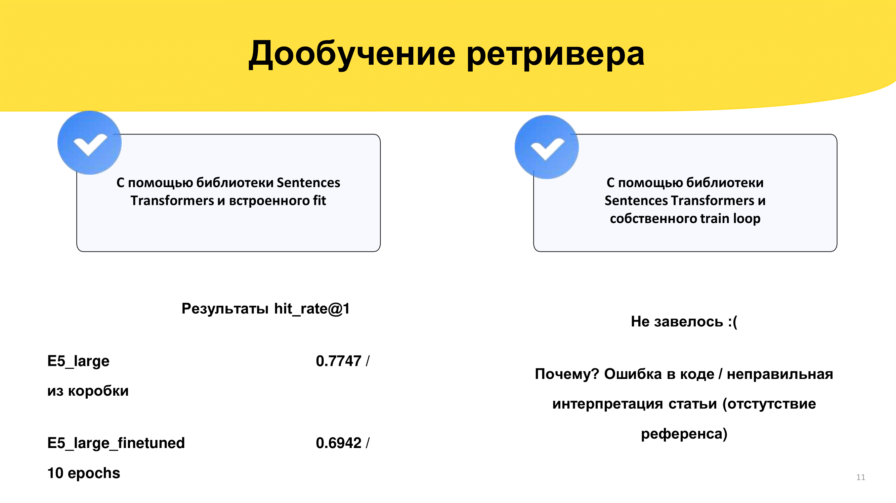
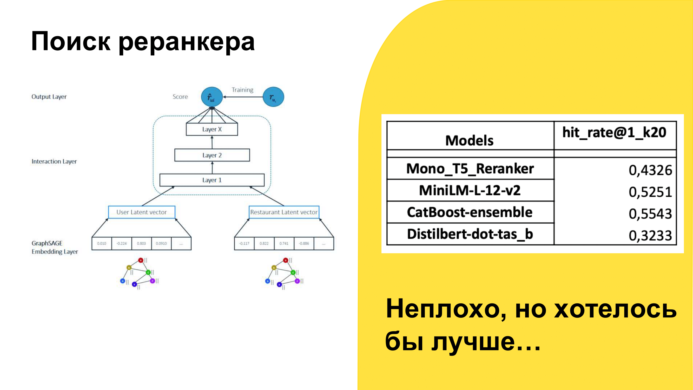
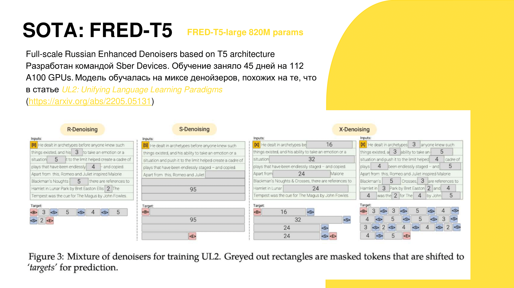
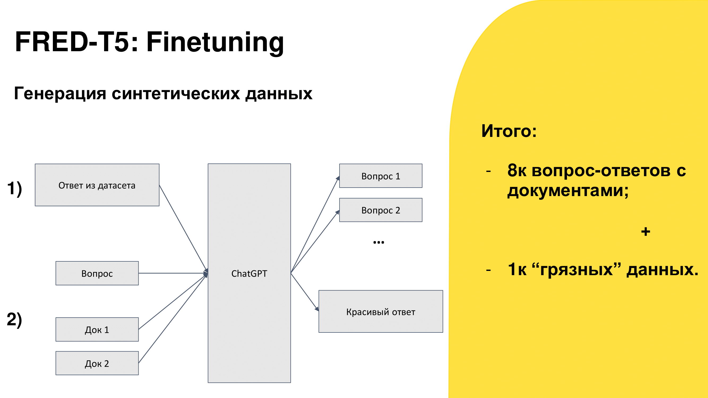
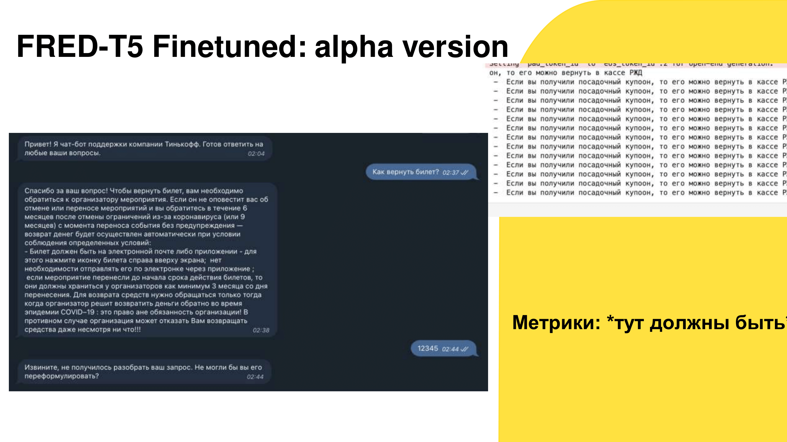
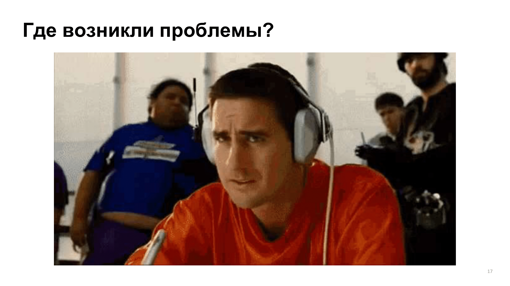
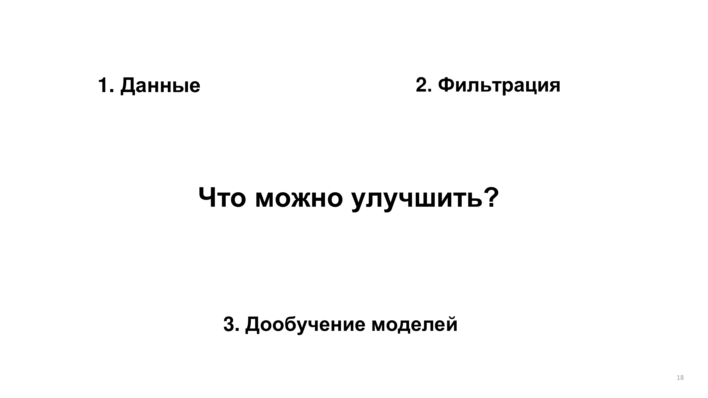
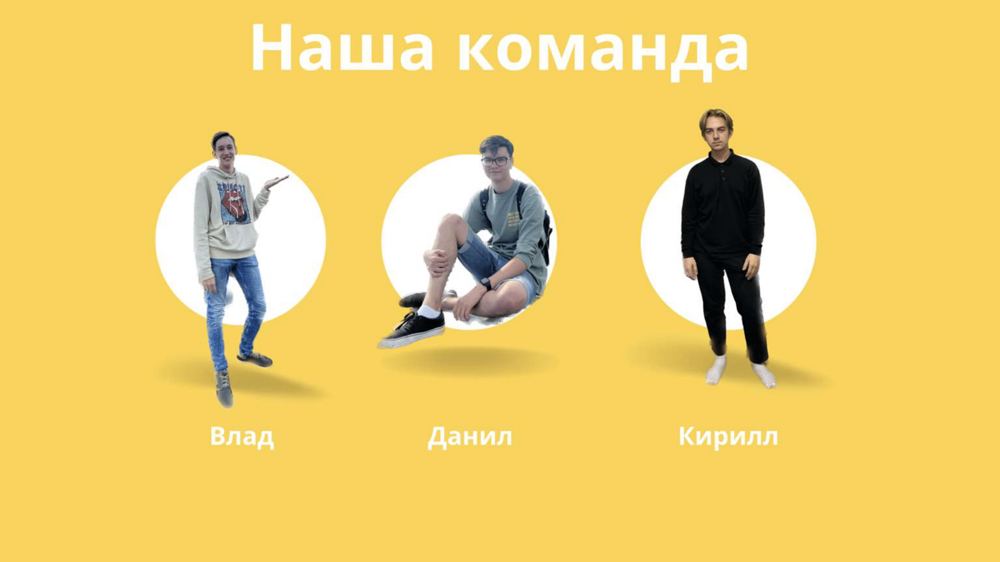

## NLP-кейс от Тинькофф: Q&A система службы поддержки
На второй неделе ML-смены Тинькофф в Сириусе нам была дана задача создания Q&A системы, которая сможет частично заменить службу поддержки банка.  
Мы обучали наши модели на открытых данных сайта https://www.tinkoff.ru/help/  
Наше решение состоит из SOTA-эмбеддера е5, векторной базы chroma и дообученного rewriter'а FRED T5  
Была проблема недостатка данных, поэтому мы генерировали синтетические данные с помощью ChatGPT  
# Вот презентация нашего проекта:

