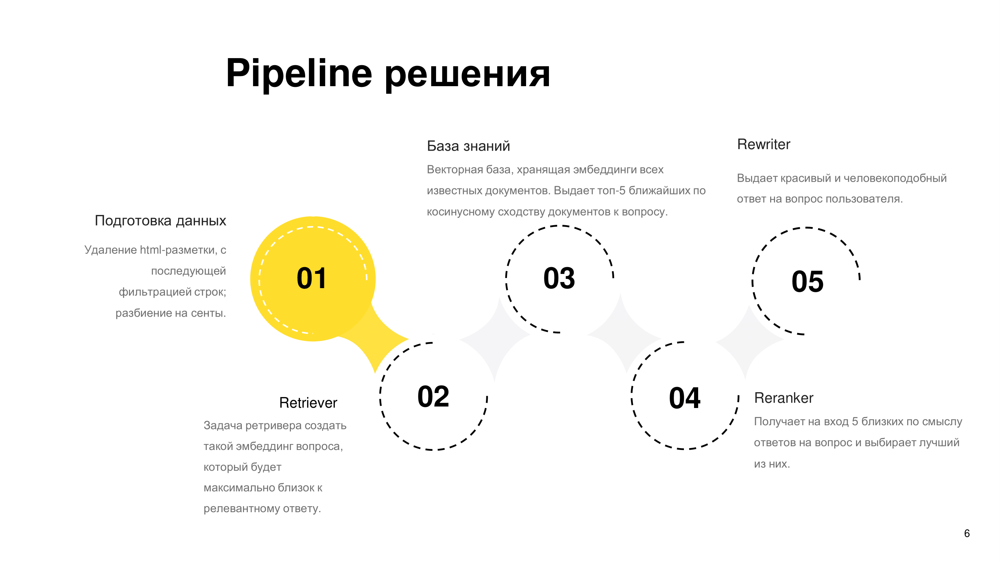
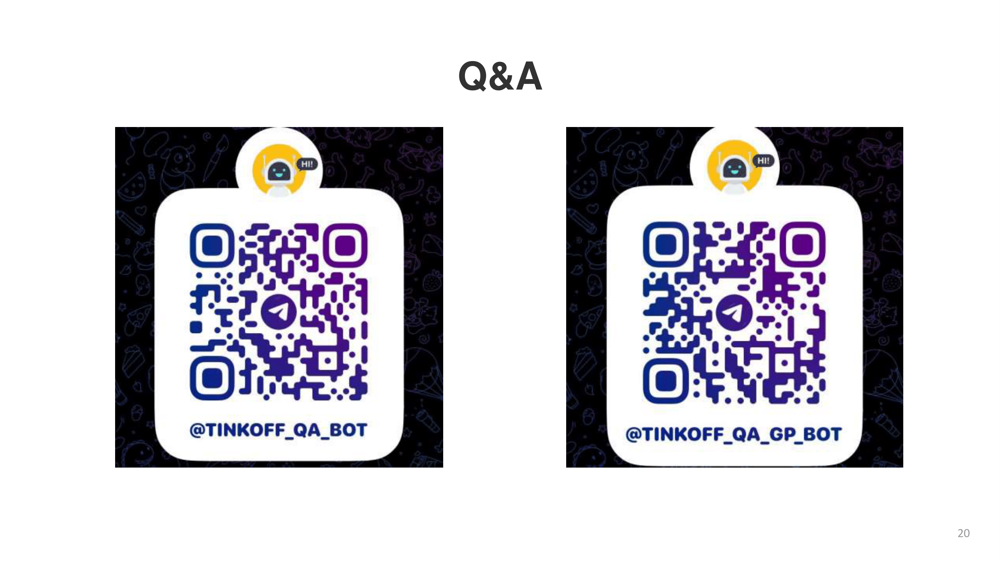

## NLP-кейс от Тинькофф: Q&A система службы поддержки
На второй неделе ML-смены Тинькофф в Сириусе нам была дана задача создания Q&A системы, которая сможет частично заменить службу поддержки банка.  
Мы обучали наши модели на открытых данных сайта https://www.tinkoff.ru/help/  
Наше решение состоит из SOTA-эмбеддера е5, векторной базы chroma и дообученного rewriter'а FRED T5  
Была проблема недостатка данных, поэтому мы генерировали синтетические данные с помощью ChatGPT  
HitRate@1 на чистом эмбеддере(создаем эмбеддинги всех документов, создаем эмбеддинг вопроса и возвращаем самый близкий по косинусному сходству) составлял около 75%.  
HitRate@5 был больше 90%. Именно топ-5 самых релевантных документов мы подавали на вход Фреду, и он создавал из них четкий(почти) ответ.  
Фреда мы дообучали с помощью Lor'ы на синтетических данных сгенерированных с помощью ChatGPT.  
Но у Фреда было две проблемы:
1) Переобучился на ответах вроде "я вас не понял, уточните о каком Тинькофф вы говорите" (эта проблема возникала из за того, что ChatGPT с помощью которого мы формировали датасет для fine-tuning'а Фреда слишком часто отвечал так на наши промпты)
2) Галюцинации модели: Упоминание служб поддержки других банков, ответ от имени руководителя следственного комитета ЛенОбласти, генерация рандомных токенов, повторящиеся куски текста
  
Для качественных ответов модели необходимы реальные чистые данные взаимодействия поддержки и пользователя.  
Чтобы избавится от галюцинаций нужно понять откуда они происходят, и опять же расширить датасет.  
Модель хорошо отвечает на вопросы, максимально близкие к тем, которые находились в трейне, на вопросы, темы которых в трейне не поднимались, он либо переспрашивает или галюционирует.  
При развитии проекта в промпт Фреда можно будет добавлять последние сообщения в чате под тегом "context": .
# Вот презентация нашего проекта:

